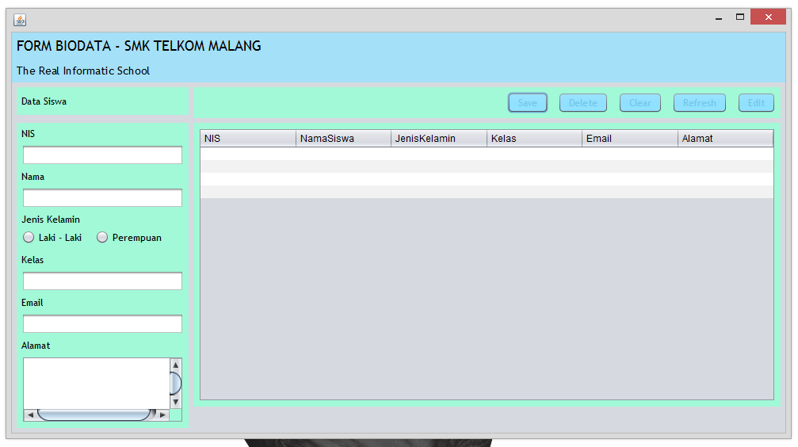
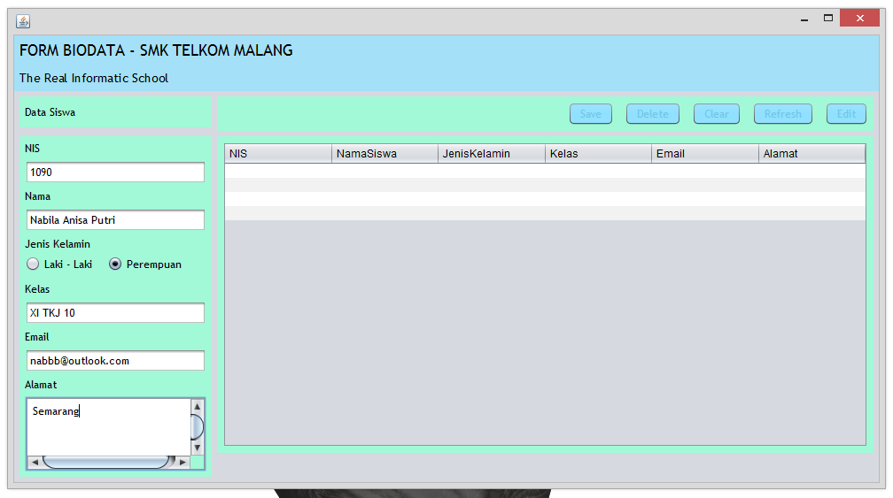
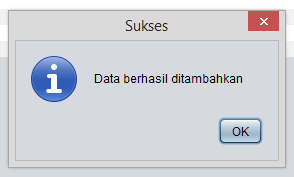
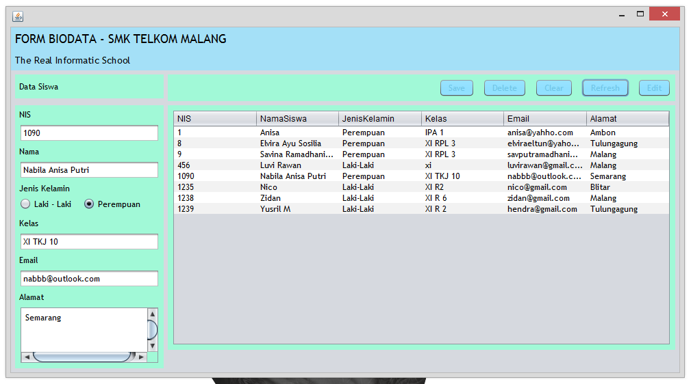
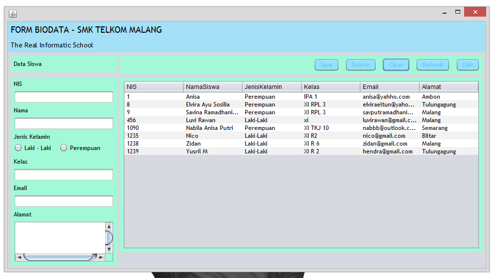
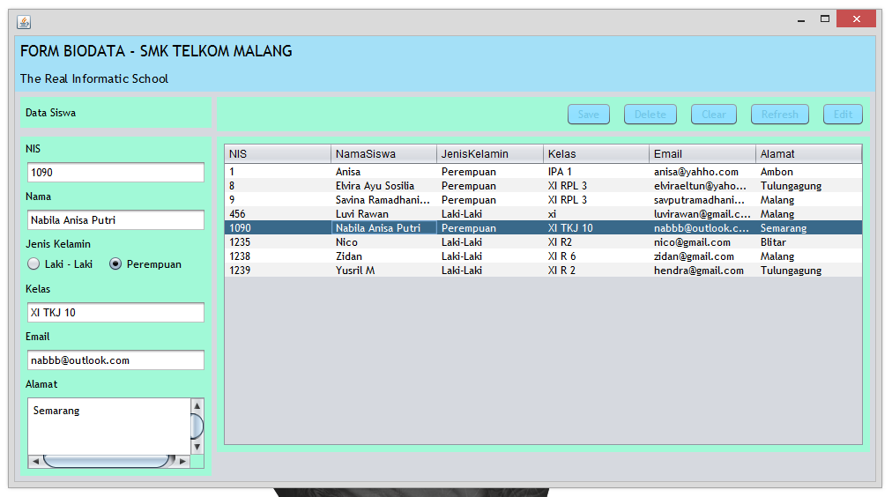
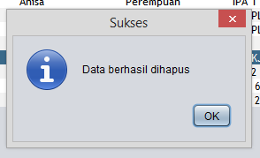

# TestCRUD

Nama : Savina Ramadhani Putri T

Kelas : XIRPL3 - 31

Nama Sekolah : SMK Telkom Malang

# Screenshoot Hasil Program

Screenshoot1

Screenshhot2

Screenshoot3

Setelah anda berhasil Sign In, anda akan masuk kehalaman selanjutnya seperti ini :

Screenshoot4

Isi form untuk menginputkan data, kemudian klik button save dan akan keluar informasi sukses (screenshoot 5)

Screenshoot5

Klik button Refresh untuk mengetahui data yang telah dimasukkan

Screenshoot6

Klik button Clear untuk menghapus isian pada form tersebut

Screenshoot7

Jika anda ingin menghapus data tersebut klik data pada tabel, kemudian klik button delete dan kemudian refresh (screenshoot 7,8 & 9)

Screenshoot8

Screenshoot9

Screenshoot10

Screenshhot11

